# hft-arb-bot-go

Go port of [hft-arb-bot](https://github.com/zinxer/hft-arb-bot) (Node.js); a new implementation with new commit history; untested against live exchanges; not financial advice; not audited; use at your own risk.

> **WARNING: the exchange adapters are UNVERIFIED.** The REST adapters for the master (Luno) and slaves (Kraken, Binance) were written from public API documentation and have never been run against a live exchange or a sandbox. Endpoints, symbol mappings, signing and response parsing may be wrong. The strategy logic is covered by unit tests against an in-memory mock only. Do not run this with funds you cannot lose; if you try it, use tiny sizes.

## What it does

A cross-exchange arbitrage bot. It watches one **master** exchange (Luno, quoted in MYR) against one or more **slave** exchanges (Kraken, Binance, quoted in USDT). When the price gap exceeds a threshold it rests a limit order on the master and, once filled, hedges with a market order on the slave.

Per asset, in its own goroutine (cancelled via `context`):

1. Fetch tickers and balances from every exchange and the USDT/MYR rate (fixed `USDTMYR` if set, else the master's USDT/MYR market ticker, else a public price API; cached for 60 minutes).
2. Convert each slave bid to MYR and compute the gap against the master last price. The slave with the largest absolute gap is chosen.
3. If the gap is at least `SAFE_GAP_PERCENT` (the bot refuses to start below 0.5):
   - Master above slave: rest a **sell** limit on the master slightly below its ask.
   - Master below slave: rest a **buy** limit on the master slightly above its bid.
   - Balances on both sides are checked against `ORDER_SIZE_MYR` first.
4. On the next cycle the open order is cancelled; if it was filled, a **market order of the opposite side** is placed on the slave and the profit in MYR is logged (and appended to `trade_data.csv`).
5. On `SIGINT`/`SIGTERM` the loops stop, open limit orders are cancelled and any fills are hedged before exit.

```mermaid
flowchart TD
    A[Fetch tickers, balances, USDT/MYR] --> B[Gap = master vs best slave in MYR]
    B -->|gap < SAFE_GAP_PERCENT| A
    B -->|gap >= threshold| C{Master above slave?}
    C -->|yes| D[Master: sell limit below ask]
    C -->|no| E[Master: buy limit above bid]
    D --> F[Next cycle: cancel order, check fill]
    E --> F
    F -->|filled| G[Slave: opposite market order]
    G --> H[Log trade and profit]
    F -->|not filled| A
    H --> A
    S[SIGINT / SIGTERM] --> X[Stop loops, cancel open orders, hedge fills, exit]
```



## Port notes and honest comparison

Compared with the Node.js version, this port keeps the strategy and parameters but is a fresh implementation.

- **Latency is dominated by exchange network round-trips and rate limits**, not by the language. This repo makes no speed claim over the Node version.
- The only thing measured is the pure gap computation (no I/O), see [Benchmark](#benchmark).
- Real benefits of the Go version: a single static binary, goroutine-per-asset concurrency with context cancellation, predictable GC, typed config, and a testable `Exchange` interface with an in-memory mock.

Deliberate differences from the Node bot:

- A partially filled master order is hedged for the filled amount after cancel (Node returned without hedging unless the order was fully complete).
- The slave `fetchOrder` read-back failing after a successful hedge never causes a second hedge; the profit is just logged as unknown.
- The order operations of a cycle are detached from the cancellation context so a shutdown cannot orphan an order.
- Not ported: the console dashboard and ANSI colours, `balances.txt`, the background `luno_<ASSET>MYR.csv` trade poller, the 10 s start-up pause, the FTX slave. There is no remote control or chat interface of any kind.

## Configuration

Environment variables (same names as the Node bot). A `.env` file in the working directory is loaded if present; real environment variables win.

| Variable | Required | Description |
|---|---|---|
| `LUNO_KEY`, `LUNO_SECRET` | yes | Master exchange API credentials |
| `KRAKEN_KEY`, `KRAKEN_SECRET` | one slave required | Kraken credentials |
| `BINANCE_KEY`, `BINANCE_SECRET` | one slave required | Binance credentials |
| `ASSETS` | yes | Comma-separated base assets: `BTC,BCH,ETH,XRP,LTC` (precision table) |
| `ORDER_SIZE_MYR` | yes | Order size in MYR |
| `SAFE_GAP_PERCENT` | yes | Minimum price gap in percent to trade (must be at least 0.5) |
| `CYCLE_TIME_MS` | yes | Pause after placing an order, in ms |
| `POST_ONLY` | no | `true` places post-only limit orders |
| `USDTMYR` | no | Fixed USDT/MYR rate; otherwise market ticker, then public price API |
| `PRICE_OFFSET` | no | Limit price offset as a fraction (default `0.0001`) |

## Run

Requires Go 1.22+.

```bash
cp .env.example .env   # placeholders only; fill in your own values, never commit .env
go run ./cmd/hft-arb-bot
```

Output goes to stdout (structured `slog`). Trades are appended to `trade_data.csv` (git-ignored).

## Develop

```bash
go vet ./...
gofmt -l .            # must print nothing
go test -race ./...
go test -run '^$' -bench . -benchmem ./internal/strategy
go build ./...
```

## Benchmark

`BenchmarkGapHotPath` (gap + slave choice for two slaves) and `BenchmarkGapPercent` (single gap), `shopspring/decimal`, no I/O. One run on an Apple M4 Pro, arm64, Go 1.27:

| Benchmark | ns/op | B/op | allocs/op |
|---|---|---|---|
| `GapHotPath` | ~665 | 1728 | 60 |
| `GapPercent` | ~289 | 776 | 26 |

These are sub-microsecond; one exchange HTTP round-trip is orders of magnitude larger. Arbitrary-precision decimals are chosen for correctness, not speed.

## Project layout

```
cmd/hft-arb-bot/        entrypoint, signal handling, trade CSV
internal/config/        env + .env loading and validation
internal/exchange/      Exchange interface, MockExchange, Luno/Kraken/Binance REST adapters (unverified)
internal/strategy/      pure math (math.go), rate provider (rate.go), per-asset loop + lifecycle (bot.go)
.github/workflows/      ci.yml (vet, gofmt, test -race, build), secret-scan.yml (gitleaks, full history)
```

## Secret hygiene

`.gitignore` blocks `.env*` (except `.env.example`), key/keystore files and `secrets/`. `.pre-commit-config.yaml` runs gitleaks locally, `.gitleaks.toml` configures it, and CI scans the full history. Install the hook with `pre-commit install`.

## Disclaimer

Not financial advice, not audited, untested against live exchanges, use at your own risk. Trading can lose money.

## License

MIT, see [LICENSE](LICENSE).
